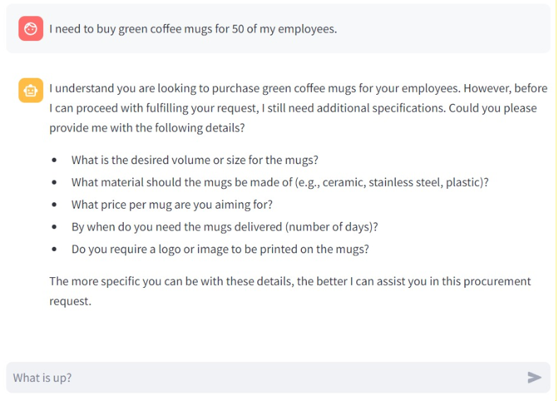
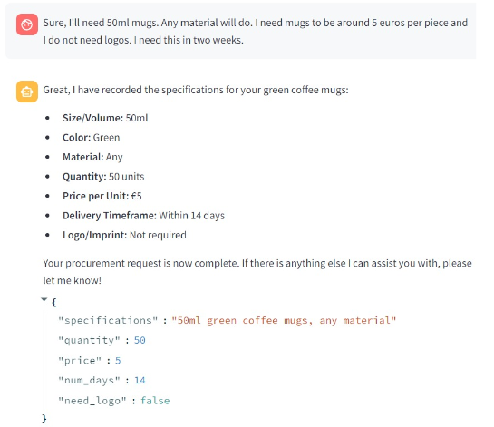
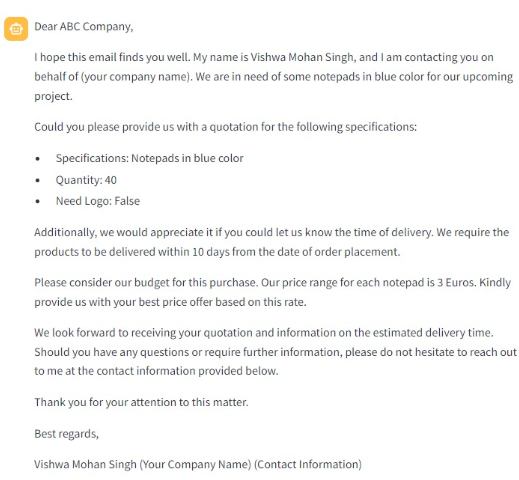
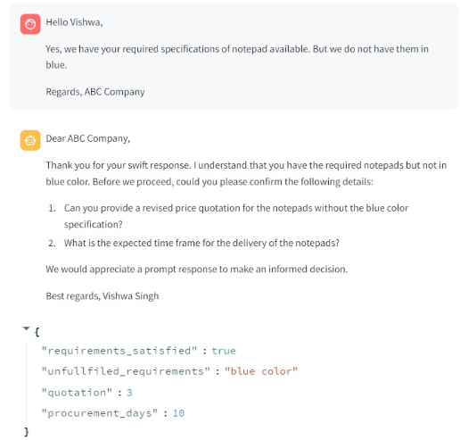

# auto.Negotia - Automatic Procurement Agent
auto.Negotia s an end-to-end procurement automation platform utilizing a chatbot interface and automated email communication. Here's a breakdown of its functionality:

**Customer Interaction:** The chatbot engages with customers to gather specific details about the product they require. The chatbot compiles this information into a structured JSON format, capturing the correct specifications of the customer's needs.  
</img>
</img>
 
**Vendor Matching:** The system has a predefined list of vendors, each with descriptions of the products they offer. Using the embeddings, the system matches the customer's requirements to suitable vendors from the list using similarity metrics. 

**Request for Quotation (RFQ):** The system automatically generates and sends emails to the matched vendors, requesting quotes, timelines, and additional details. Vendors are prompted to provide information about what they can and cannot deliver, along with any alternative solutions they might offer. 
</img>
</img>
 
**Quote Comparison:** Upon receiving responses, the system aggregates and compares the quotes and details like timeline and alternatives from different vendors. It identifies the vendor with the least cost and the shortest delivery timeline as the initial "best vendor" using a weighted sum of the cost, timeline and fulfilled requirements. If the best vendor does not have the least cost and least days to deliver the product across the selection, the negotiation process is initiated.
